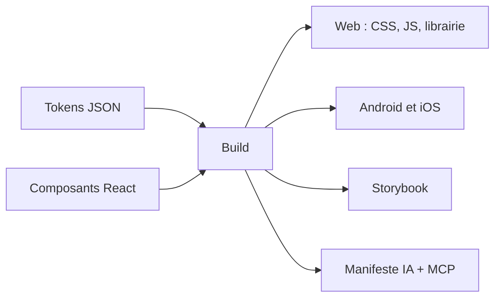
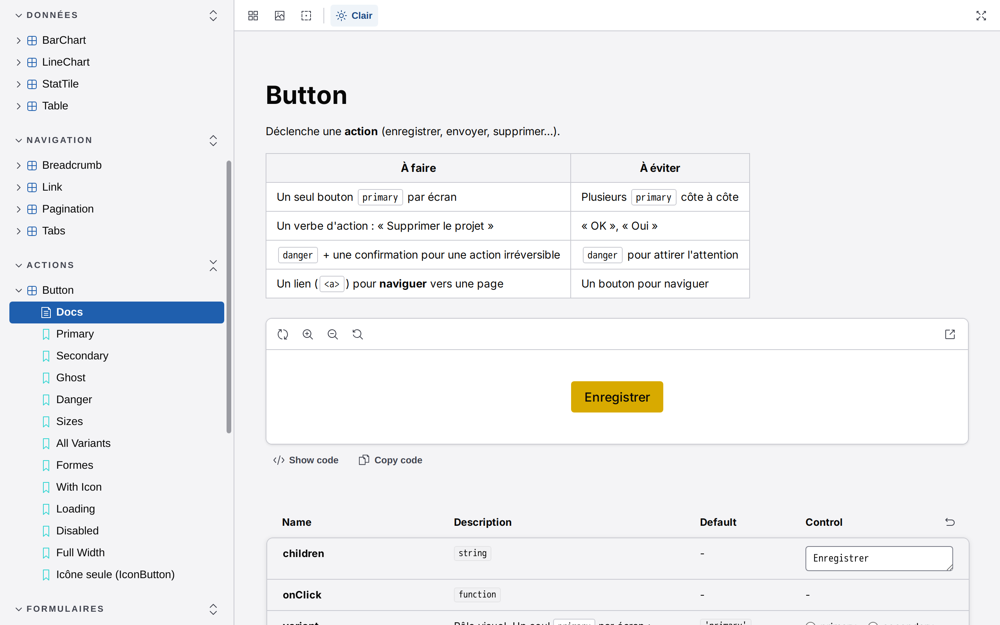
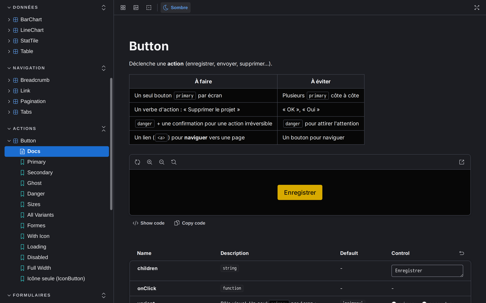
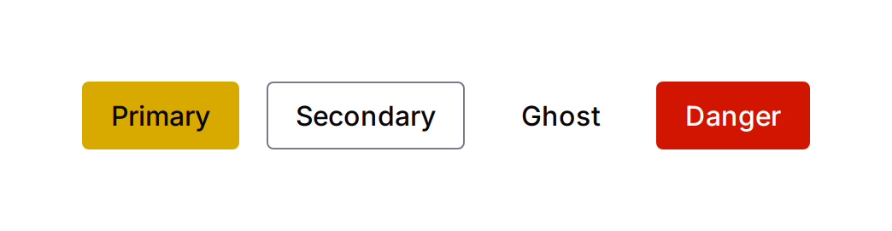
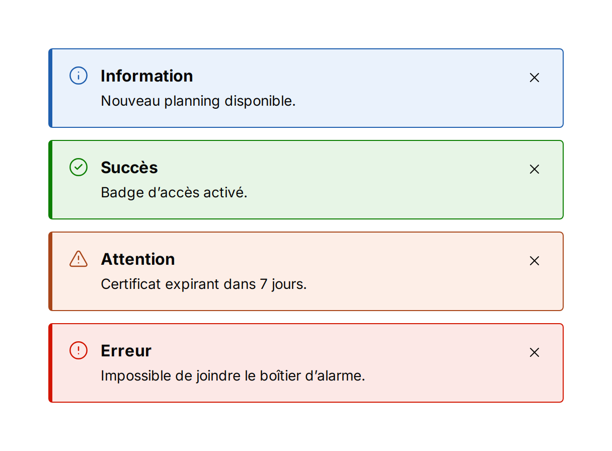
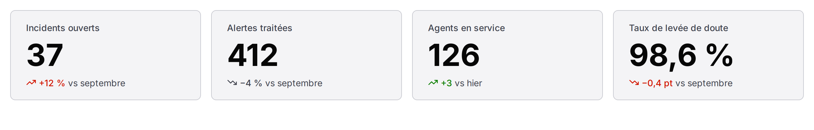
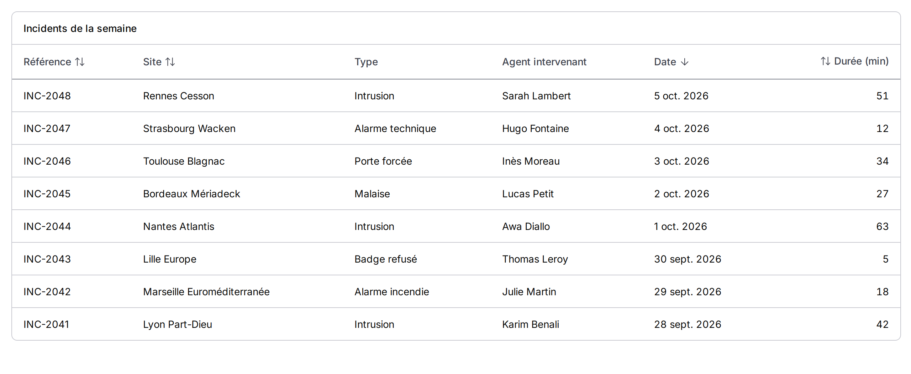
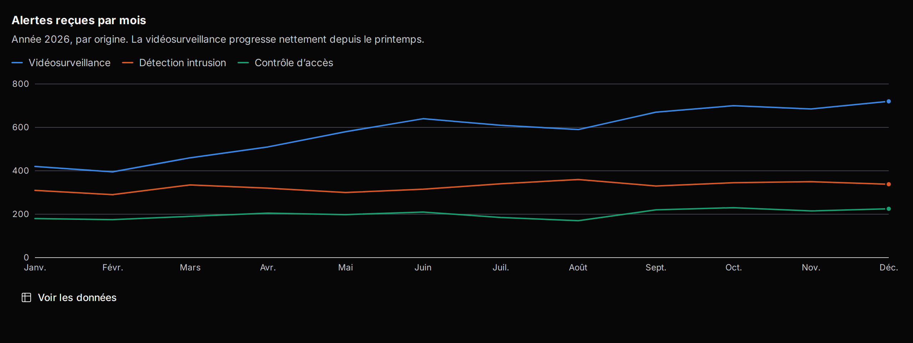
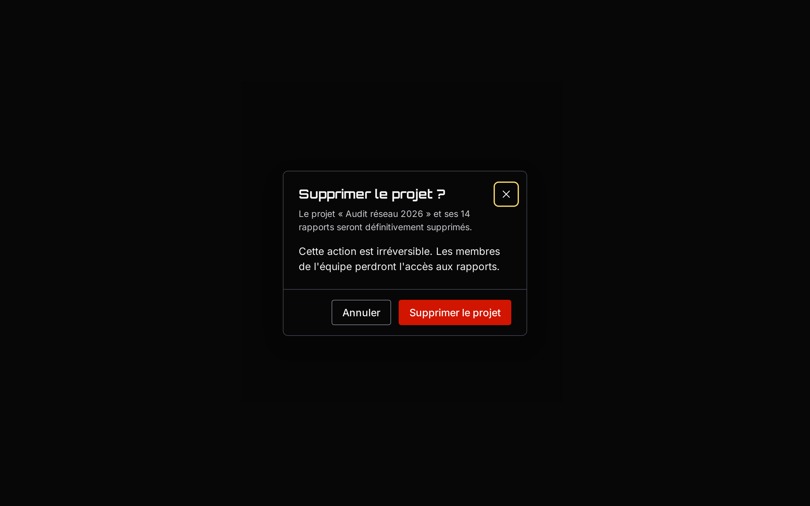

# design-system-starter

Un **starter réutilisable de design system** : on le clone, on l'adapte à une marque, et on dispose d'une base complète, accessible et vérifiée automatiquement pour n'importe quel projet.

- **Design tokens** au format standard DTCG, avec thèmes clair et sombre, générés pour le **web**, **Android** (Compose, XML) et **iOS** (SwiftUI)
- **Plus de 30 composants React** accessibles (formulaires, superpositions, navigation, tableaux, graphiques…), documentés dans **Storybook**
- **Garde-fous automatiques** : tokens obligatoires dans le CSS, contrastes WCAG, audit d'accessibilité de chaque composant, CI GitLab et GitHub
- **Prêt pour les agents IA** : manifeste généré depuis le code, skill, et serveur **MCP** qui vérifie le code produit



## Aperçu

L'interface Storybook suit le thème choisi dans la barre d'outils, en clair comme en sombre : chaque composant a sa page de documentation (règles « À faire | À éviter », exemple interactif, tableau des props).

| Thème clair | Thème sombre |
|---|---|
|  |  |

Quelques composants :

| Boutons | Alertes |
|---|---|
|  |  |

| Indicateurs clés (StatTile) |
|---|
|  |

| Tableau triable (Table) |
|---|
|  |

| Graphique (LineChart, thème sombre) | Modale de confirmation (thème sombre) |
|---|---|
|  |  |

Ces captures sont générées automatiquement depuis Storybook : voir [Démarrage](docs/01-demarrage.md#commandes).

## Démarrage rapide

Seul **Docker** est nécessaire : Node.js et les outils tournent dans des conteneurs.

```bash
docker compose run --rm node npm install    # dépendances
docker compose run --rm node npm run build  # tokens + librairie + manifeste IA
docker compose up storybook                 # http://localhost:6006
```

## Utilisation dans une application

```tsx
import 'design-system-starter/styles.css'; // une fois, à la racine

import { Button, Input, Stack } from 'design-system-starter';

<Stack gap="4">
  <Input label="Adresse e-mail" type="email" />
  <Button variant="primary">Continuer</Button>
</Stack>;
```

Thème sombre : `<html data-theme="dark">`. Installation détaillée : [Versions et publication](docs/09-versions-et-publication.md).

## Documentation

| Guide | Contenu |
|---|---|
| [Démarrage](docs/01-demarrage.md) | Prérequis, commandes, structure du dépôt |
| [Architecture](docs/02-architecture.md) | Vue d'ensemble, du JSON jusqu'aux applications |
| [Tokens](docs/03-tokens.md) | Les trois niveaux, les règles, ajouter un token |
| [Thèmes](docs/04-themes.md) | Clair et sombre : web, Storybook, mobile |
| [Build multiplateforme](docs/05-build-multiplateforme.md) | Style Dictionary, sorties, ajouter une plateforme |
| [Composants](docs/06-composants.md) | Catalogue, conventions, ajouter un composant |
| [Qualité](docs/07-qualite.md) | Garde-fous et intégration continue |
| [IA et MCP](docs/08-ia-et-mcp.md) | Manifeste, skill, serveur MCP |
| [Versions et publication](docs/09-versions-et-publication.md) | Changesets, paquet, installation |
| [Adapter le starter](docs/10-adapter-le-starter.md) | Personnaliser pour un nouveau projet |
| [Décisions](docs/11-decisions.md) | Les choix d'architecture et leurs raisons |

La documentation de chaque composant (props, exemples, règles d'usage) est dans **Storybook**. Les agents IA qui travaillent sur ce dépôt lisent [`AGENTS.md`](AGENTS.md).

## Commandes principales

| Commande | Rôle |
|---|---|
| `docker compose run --rm node npm run check` | Toutes les vérifications (tokens, lint, formatage, types) |
| `docker compose run --rm node npm run build` | Tokens, librairie et manifeste IA dans `dist/` |
| `docker compose run --rm a11y` | Audit d'accessibilité de toutes les stories |
| `docker compose run --rm node npx changeset` | Décrire une modification pour la prochaine version |
| `docker compose run --rm a11y sh -c "npm run build:storybook && node scripts/capture-screenshots.mjs"` | Régénérer les captures d'écran du README |

Historique des versions : [CHANGELOG.md](CHANGELOG.md).
