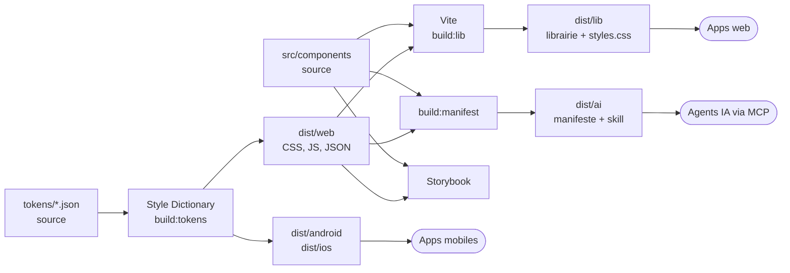
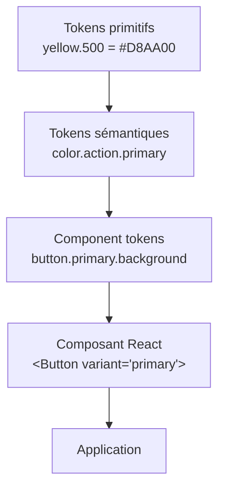
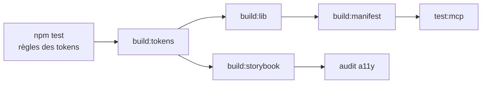

# Architecture

Le design system repose sur un principe : **une seule source de vérité par décision**. Une couleur, un espacement ou une règle d'usage est écrit une fois, puis tout le reste en est **généré** : CSS, code mobile, librairie, documentation, manifeste pour les IA.

## Vue d'ensemble

Les rectangles marqués « source » sont les seuls fichiers écrits à la main ; tout ce qui est dans `dist/` est généré. Les formes arrondies sont les utilisateurs du design system.

## Les couches

Chaque couche ne connaît **que** la couche juste en dessous :

- un composant ne contient aucune valeur brute, seulement des `var(--…)` ;
- changer de thème ou de marque ne touche **que** la couche sémantique ;
- une application n'utilise que des composants, et des tokens sémantiques pour sa mise en page.

## Ce qui est multiplateforme, et ce qui ne l'est pas

| Élément | Web | Android | iOS |
|---|---|---|---|
| Tokens (couleurs, tailles, typographie, animations) | Oui | Oui | Oui |
| Thèmes clair / sombre | Oui | Oui | Oui |
| Composants | Oui (React) | Non | Non |
| Documentation Storybook | Oui | Non | Non |

Les tokens sont des **données** : toute plateforme peut les lire. Les composants sont du **code** : un composant mobile natif devrait être réécrit en Jetpack Compose ou en SwiftUI, avec les mêmes tokens. Voir [Décisions d'architecture](11-decisions.md).

## Dépendances entre les étapes du build

On construit **dans l'ordre des dépendances** : les tests des tokens bloquent tout le reste, si bien qu'il est impossible de générer des tokens invalides.
