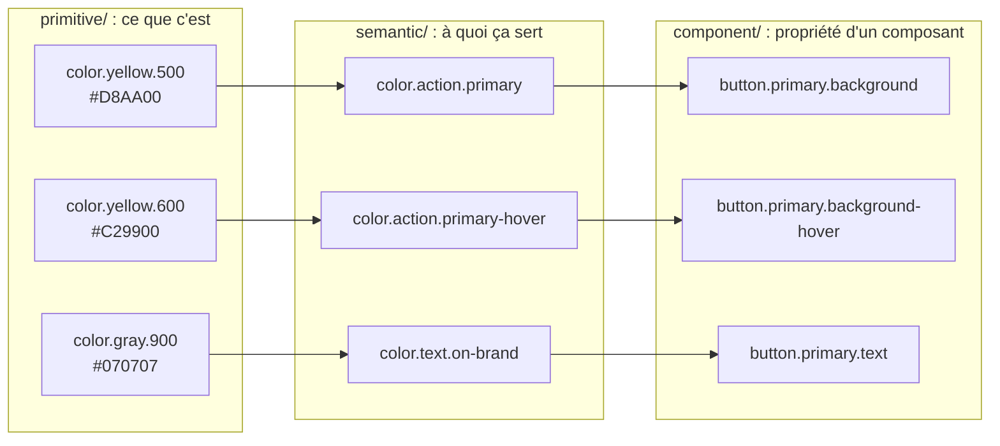
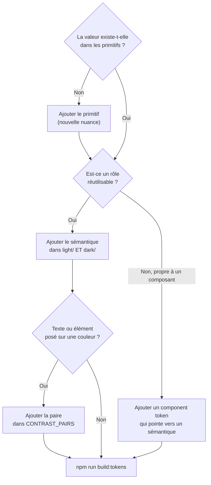

# Tokens

Un **design token** est une décision de design nommée : une paire clé / valeur. Les tokens sont écrits en JSON au format standard du W3C ([DTCG](https://www.designtokens.org/)) : chaque token a une valeur `$value` et un type `$type`.

```json
{ "color": { "yellow": { "500": { "$value": "#D8AA00", "$type": "color" } } } }
```

Le chemin donne le nom : `color.yellow.500`, qui devient `--color-yellow-500` en CSS.

## Les trois niveaux



| Niveau | Nom décrit | Exemple | Change quand… |
|---|---|---|---|
| **Primitif** | ce que c'est | `color.gray.900` | presque jamais : on **ajoute** des nuances |
| **Sémantique** | à quoi ça sert | `color.text.default` | on change de thème ou de marque |
| **Composant** | la propriété d'un composant | `button.primary.background` | un composant doit diverger sans toucher aux autres |

Un alias s'écrit entre accolades : `"$value": "{color.gray.900}"`. Chaque niveau pointe **uniquement** vers celui du dessous ; un composant n'utilise **jamais** un primitif directement.

## Catégories

| Fichier | Contenu | Type DTCG |
|---|---|---|
| `primitive/color.json` | palette : marque, gris, statuts, couleurs de graphiques | `color` |
| `primitive/spacing.json` | échelle de 4px : `space.1` = 4px… `space.16` = 64px | `dimension` |
| `primitive/font.json` | familles, tailles, graisses, interlignes | `fontFamily`, `dimension`, `fontWeight`, `number` |
| `primitive/radius.json` | arrondis, dont `full` pour les pilules | `dimension` |
| `primitive/shadow.json` | élévations `sm`, `md`, `lg` | `shadow` |
| `primitive/layer.json` | ordres d'empilement (z-index) | `number` |
| `primitive/motion.json` | durées et courbes d'accélération | `duration`, `cubicBezier` |
| `primitive/icon.json`, `opacity.json` | tailles d'icônes, opacité des états désactivés | `dimension`, `number` |
| `semantic/typography.json` | styles de texte composites (titre, corps, légende…) | `typography` |
| `semantic/light/`, `dark/` | rôles de couleur par thème | `color` |
| `component/<nom>.json` | propriétés d'un composant | divers |

## Règles

Vérifiées automatiquement par `npm test` (`scripts/check-tokens.mjs`), qui bloque le build en cas d'échec :

1. Chaque alias pointe vers un token qui existe (pas de référence circulaire).
2. `semantic/light` et `semantic/dark` ont **exactement les mêmes clés**.
3. Chaque paire de couleurs déclarée dans `CONTRAST_PAIRS` respecte le contraste WCAG AA : **4,5:1** pour du texte, **3:1** pour un élément d'interface (bordure de champ, anneau de focus), dans **les deux thèmes**.

Règles de conduite :

- **On ajoute, on ne remplace pas.** Une nuance qui ne convient plus reste en place ; on en ajoute une autre. Renommer ou supprimer un token est un changement **cassant** (version majeure).
- **Une échelle, pas des valeurs libres.** Pas de `13px` : on choisit dans `space.*`.
- Les couleurs `chart.categorical.1` à `5` s'utilisent **dans l'ordre** : cet ordre est validé pour les daltoniens.

## Ajouter un token



## Retirer un token

1. Le marquer comme déprécié (`"$deprecated": "Utiliser color.xxx à la place"`) et l'annoncer dans un changeset `minor`.
2. Le supprimer dans une version **majeure** ultérieure, une fois les applications migrées.
