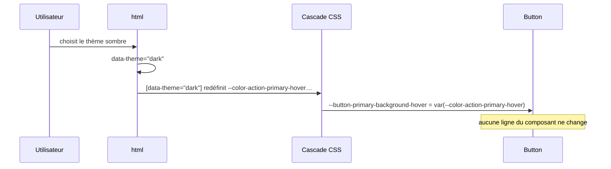
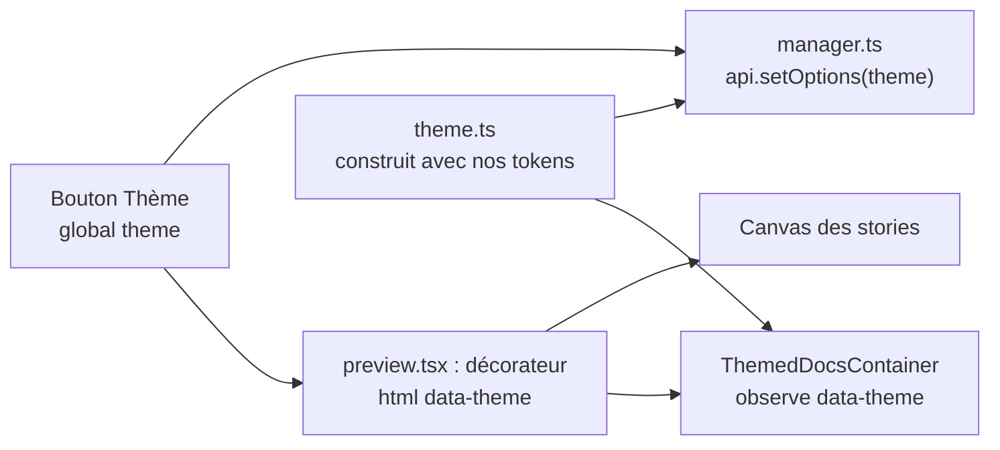

# Thèmes clair et sombre

Un thème ne remplace rien : il **ajoute une colonne** aux tokens sémantiques. Les primitifs restent la palette commune ; les composants ne changent jamais.

| Token sémantique | Clair | Sombre |
|---|---|---|
| `color.background.page` | `white` | `gray.900` |
| `color.text.default` | `gray.900` | `gray.100` |
| `color.action.primary-hover` | `yellow.600` (fonce) | `yellow.300` (éclaircit) |
| `color.feedback.danger` | `red.500` | `red.300` |

## Sur le web

Le build produit deux fichiers :

- `light.css` déclare **tous** les tokens sur `:root` (thème par défaut) ;
- `dark.css` ne redéclare **que** les sémantiques qui changent, sous `[data-theme="dark"]`.



```html
<html data-theme="dark">
```

### Piège : `data-theme` doit être posé sur `<html>`

Les component tokens sont déclarés sur `:root` et pointent vers les sémantiques : `--button-primary-background: var(--color-action-primary)`. Une variable CSS qui en référence une autre est **calculée sur l'élément où elle est déclarée**, ici `:root`. Si `data-theme="dark"` est posé sur un `<div>` intérieur, `:root` garde les valeurs claires et les composants ne changent pas de couleur.

### Styles de base

`styles.css` (le CSS de la librairie) ajoute `color-scheme: light | dark`, pour que les éléments natifs du navigateur (barres de défilement, champs de date) suivent le thème, ainsi que le fond, la couleur du texte et la police du `<body>`.

## Dans Storybook

Storybook est composé de **deux applications** : le *manager* (barre latérale, barre d'outils) et la *preview* (une iframe qui affiche les composants et les pages Docs). Le bouton **Thème** de la barre d'outils est la seule source de vérité, et les deux le suivent.



L'interface de Storybook est elle-même habillée avec les tokens du design system (`.storybook/theme.ts`). Une modification de `manager.ts` demande un redémarrage de Storybook.

## Sur mobile

| Plateforme | Mécanisme |
|---|---|
| Android (XML) | `values/colors.xml` (clair) et `values-night/colors.xml` (sombre) : Android choisit seul |
| Android (Compose) | interface `DSColors`, implémentée par `DSColorsLight` et `DSColorsDark` |
| iOS (SwiftUI) | protocole `DSColors`, implémenté par `DSColorsLight` et `DSColorsDark` |

```kotlin
val colors: DSColors = if (isSystemInDarkTheme()) DSColorsDark else DSColorsLight
```

Comme `DSColorsDark` doit implémenter le même contrat que `DSColorsLight`, un token oublié dans un thème **ne compile pas** : c'est la règle « mêmes clés dans light et dark », imposée par le langage.

## Ajouter un thème ou une marque

1. Créer `tokens/semantic/<theme>/color.json` avec **les mêmes clés** que `light/`.
2. Ajouter `'<theme>'` à la liste `themes` de `build-tokens.mjs` et de `scripts/check-tokens.mjs`.
3. Activer le thème avec `data-theme="<theme>"`.

Les axes se combinent (marque × mode) : chaque nouvel axe **multiplie** le nombre de thèmes, mais aucun composant n'est réécrit.
