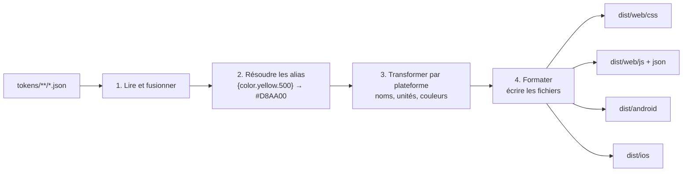

# Build multiplateforme

Les tokens JSON sont neutres : aucune plateforme ne les comprend telle quelle. [Style Dictionary](https://styledictionary.com) les **traduit** pour chaque plateforme. La configuration est dans `build-tokens.mjs`.

## Fonctionnement



Le build tourne **une fois par thème** (`light`, `dark`), car les deux thèmes utilisent les mêmes noms de tokens et s'écraseraient s'ils étaient chargés ensemble.

## Sorties

| Plateforme | Fichiers | Contenu |
|---|---|---|
| Web, CSS | `web/css/light.css`, `dark.css` | Variables CSS. `dark.css` ne redéfinit que les couleurs de thème |
| Web, JS | `web/js/light.js`, `dark.js` (+ `.d.ts`) | Constantes typées, un fichier complet par thème |
| Outils, IA | `web/json/light.json`, `dark.json` | Liste des tokens avec leur nom de variable CSS |
| Android Compose | `android/compose/*.kt` | `DSTokens` (commun), `DSColors` (interface), `DSColorsLight` / `DSColorsDark` |
| Android XML | `android/xml/values/`, `values-night/` | `colors.xml`, `dimens.xml` |
| iOS SwiftUI | `ios/*.swift` | `DSTokens`, `DSColors` (protocole), `DSColorsLight` / `DSColorsDark`, `DSSupport` |

## Utilisation par plateforme

```css
/* Web */
.carte {
  background: var(--color-background-raised);
  padding: var(--space-4);
  transition: background var(--duration-fast) var(--easing-standard);
}
```

```kotlin
// Android Compose
Text(
    "Bonjour",
    color = colors.colorTextDefault,
    style = DSTokens.typographyHeadingLg.copy(fontFamily = orbitron), // la police vient des ressources de l'app
)
```

```swift
// iOS SwiftUI
Text("Bonjour")
    .font(DSTokens.typographyHeadingLg.font)
    .lineSpacing(DSTokens.typographyHeadingLg.lineSpacing)
    .foregroundStyle(colors.colorTextDefault)
```

## Transforms et formats maison

| Fichier | Rôle |
|---|---|
| `build-tokens.mjs` : `size/pxToDpSp` | Convertit `16px` en `16dp` (ou `16sp` pour les tailles de texte, qui suivent le réglage d'accessibilité de l'utilisateur) |
| `build/kotlin.mjs` | Écrit des `Color`, `dp`, `TextStyle`, `CubicBezierEasing` pour Compose |
| `build/swift.mjs` | Écrit des `Color`, `CGFloat`, `Font.Weight`, styles de texte et courbes pour SwiftUI |
| `build/json.mjs` | Liste JSON des tokens, lue par le manifeste IA |
| `build/helpers.mjs` | Conversions communes (px, ms, hexadécimal → RGB) et filtres (thème, composant) |

Pourquoi des formats maison : les groupes mobiles fournis par Style Dictionary considèrent les tailles comme des `rem` et les multiplient par 16. Avec nos tokens en `px`, `space.4 = 16px` serait devenu `256dp`, **sans aucune erreur affichée**.

## Ajouter une plateforme

Chaque plateforme est un bloc de `platforms` dans `build-tokens.mjs`. Pour une plateforme standard, copier un bloc et changer `transformGroup` (ou `transforms`), `format` et `buildPath`.

| Cible | `transformGroup` | `format` |
|---|---|---|
| SCSS | `scss` | `scss/variables` |
| Less | `less` | `less/variables` |
| TypeScript (types) | `js` | `typescript/es6-declarations` |
| JSON | `js` | `json/nested` |
| Flutter (Dart) | `flutter` | `flutter/class.dart` |
| React Native | `react-native` | `javascript/es6` |

Pour une plateforme mobile, s'inspirer des formats de `build/` plutôt que des groupes fournis (problème des `rem` ci-dessus). Un format sur mesure est une fonction qui reçoit les tokens et renvoie le texte du fichier, enregistrée avec `StyleDictionary.registerFormat()`.

Références : [formats](https://styledictionary.com/reference/hooks/formats/predefined/), [groupes de transformations](https://styledictionary.com/reference/hooks/transform-groups/predefined/), [créer un format](https://styledictionary.com/reference/hooks/formats/).

## Limites

- **Polices sur mobile** : seul le premier nom de la liste est utilisé ; les fichiers de police doivent être embarqués par l'application. En Compose, les `TextStyle` sont générés sans police (`.copy(fontFamily = …)`).
- **Ombres** : non générées sur mobile, chaque système ayant son propre modèle (élévation Android, `shadow` iOS).
- **Code natif non compilé ici** : il faudrait Android Studio et Xcode. C'est la CI de chaque application qui compile le code généré.
- **Typographie en CSS** : chaque style est éclaté en cinq variables (`-font-family`, `-font-size`, `-font-weight`, `-line-height`, `-letter-spacing`), car la propriété raccourcie `font` ne sait pas porter le `letter-spacing`.
- Le warning `filtered out token references` sur `dark.css` est **attendu** : les couleurs sombres pointent vers des primitifs déclarés dans `light.css`, qui doit toujours être chargé.
