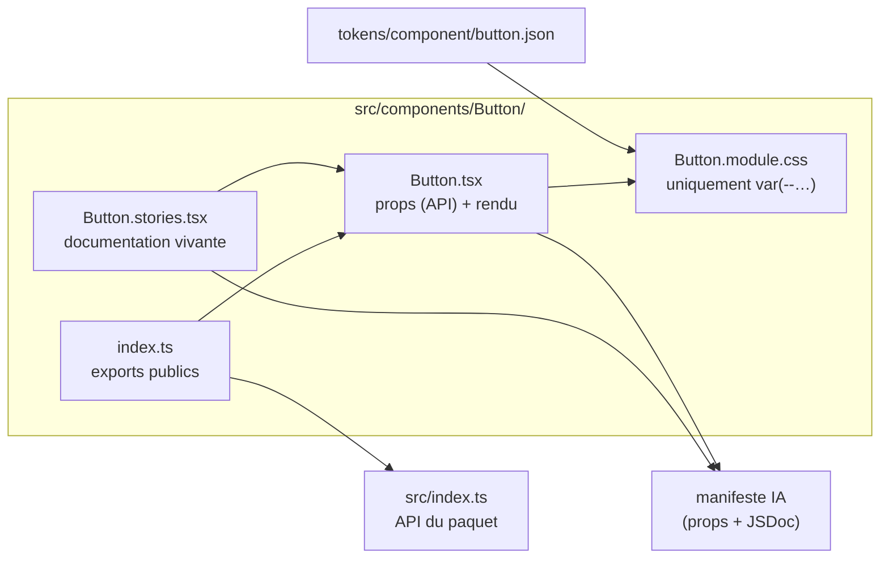
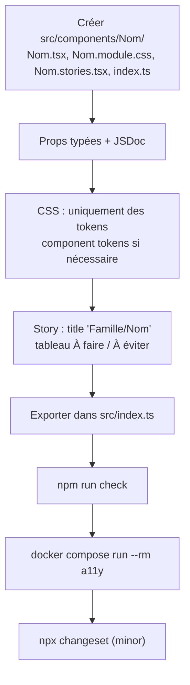

# Composants

Les composants sont en **React 19 + TypeScript**, stylés avec des **CSS Modules**, et documentés dans **Storybook** (http://localhost:6006). La fiche de chaque composant (props, exemples, règles « À faire / À éviter », audit d'accessibilité) est générée depuis son code.

## Catalogue

| Famille | Composants |
|---|---|
| Fondations | `Icon` (icônes SVG [Lucide](https://lucide.dev/icons)), `VisuallyHidden` |
| Mise en page | `Stack` |
| Actions | `Button`, `IconButton` |
| Formulaires | `Field` (base commune), `Input`, `Textarea`, `Select`, `Checkbox`, `RadioGroup` / `Radio`, `Switch`, `SearchBar` |
| Affichage | `Card` (+ `CardHeader`, `CardBody`, `CardFooter`, `CardMedia`, `CardLink`), `Badge`, `Avatar`, `Divider` |
| Feedback | `Alert`, `Toast` (`ToastProvider` + `useToast`), `Spinner`, `Skeleton`, `ProgressBar` |
| Superpositions | `Modal`, `Tooltip`, `DropdownMenu` |
| Navigation | `Link`, `Tabs`, `Breadcrumb`, `Pagination` |
| Données | `Table`, `StatTile`, `BarChart`, `LineChart` |
| Hooks | `useControllableState`, `useClickOutside` |

## Anatomie d'un composant

Un composant varie selon trois axes :

| Axe | Question | Contrôlé par | Exemple |
|---|---|---|---|
| **Variante** | quel est son rôle ? | le développeur (prop) | `variant="danger"` |
| **Taille** | quelle densité ? | le développeur (prop) | `size="sm"` |
| **État** | que se passe-t-il ? | l'utilisateur ou le navigateur (state) | survol, focus, chargement |

Test simple : si le développeur l'écrit dans son code, c'est une **prop** ; sinon c'est un **état**.

## Règles

- **Uniquement des tokens** dans le CSS (`var(--…)`) ; Stylelint refuse toute valeur brute. Les variantes et tailles remplissent des variables privées (`--_bg`, `--_height`) que la classe de base consomme.
- **Composant « bête »** : il affiche ce qu'on lui donne. Pas d'appel API ni de logique métier ; un `Table` trie quand on lui dit de trier (`sort` / `onSortChange`).
- **Contrôlé et non contrôlé** quand c'est pertinent : `value` / `onChange`, ou `defaultValue`.
- **Accessibilité** : patterns [WAI-ARIA APG](https://www.w3.org/WAI/ARIA/apg/patterns/), navigation clavier complète, `:focus-visible` jamais retiré, contrastes WCAG AA, texte réservé aux lecteurs d'écran via `VisuallyHidden`.
- **Animations** avec les tokens `--duration-*` et `--easing-*`, désactivées sous `prefers-reduced-motion`.
- **Aucun emoji** dans l'interface : icônes via `Icon` + `lucide-react`.
- **JSDoc en français** sur la fonction et sur chaque prop : elle alimente Storybook et le manifeste IA.

## Ajouter un composant

Prendre `src/components/Button/` comme modèle. Les component tokens ne se créent **que** lorsqu'un composant doit pouvoir diverger des autres (voir [Tokens](03-tokens.md)).

## Limites connues

- **Tooltip** et **DropdownMenu** sont positionnés dans leur conteneur, sans portail ni détection de collision : un parent en `overflow: hidden` peut les couper.
- **Modal** utilise le piège de focus natif de `<dialog>` : après le dernier élément, le focus passe brièvement par la barre du navigateur avant de revenir dans la fenêtre ; il n'atteint jamais la page derrière.
- **Graphiques** : valeurs positives uniquement, pas de barres horizontales.
- **Pas de composants mobiles natifs** : voir [Architecture](02-architecture.md).
