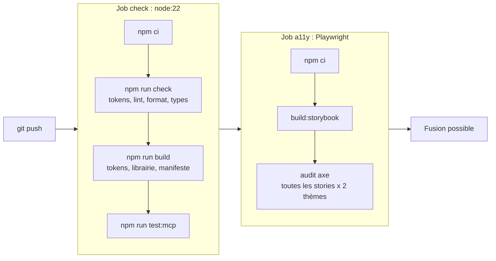

# Qualité

La qualité ne repose pas sur la vigilance : elle est **vérifiée automatiquement**, en local et à chaque push.

## Les garde-fous

| Outil | Commande | Ce qu'il empêche |
|---|---|---|
| Tests des tokens | `npm test` | alias cassé, thème incomplet, contraste insuffisant |
| **Stylelint** | `npm run lint` | toute couleur, taille, espacement, rayon, ombre, police ou z-index qui ne vient pas d'un token |
| **Oxlint** | `npm run lint` | erreurs React (règles des hooks), erreurs d'accessibilité dans le JSX, imports circulaires |
| **Prettier** | `npm run format:check` | les différences de style d'écriture |
| **TypeScript** | `npm run typecheck` | une prop inexistante, un mauvais type |
| **axe** (Playwright) | `docker compose run --rm a11y` | une violation d'accessibilité dans **une seule** story, ou un contraste insuffisant dans **une seule** page Docs, en clair ou en sombre |
| Tests du MCP | `npm run test:mcp` | une régression des vérifications de code pour les IA |

`npm run check` enchaîne tests des tokens, lint, formatage et types.

## Les exceptions

Une règle peut avoir une exception légitime (par exemple `tabIndex={0}` sur une zone qui défile, exigé par axe). Elle se déclare **à l'endroit précis, avec sa raison** :

```tsx
// oxlint-disable-next-line jsx-a11y/no-noninteractive-tabindex -- zone qui défile : atteignable au clavier
tabIndex={0}
```

```css
/* stylelint-disable-next-line scale-unlimited/declaration-strict-value -- compense exactement la bordure de 1px */
margin-bottom: -1px;
```

Une désactivation sans raison est signalée par Stylelint (`reportDescriptionlessDisables`).

## Intégration continue

Le même pipeline est décrit pour GitLab (`.gitlab-ci.yml`) et GitHub (`.github/workflows/ci.yml`).



La version de l'image Playwright doit correspondre **exactement** à celle du paquet `playwright` de `package.json` (navigateurs embarqués).

## L'audit d'accessibilité

`scripts/test-a11y.mjs` construit la liste de toutes les stories et de toutes les pages Docs depuis `storybook-static/index.json`, les ouvre dans Chromium en thème clair puis sombre (quatre onglets en parallèle) et lance [axe](https://github.com/dequelabs/axe-core) : toutes les règles sur chaque story, et les contrastes sur chaque page Docs entière, habillage de Storybook compris (tableaux, blocs de code, tableau des props). Une seule violation fait échouer la commande (code de sortie 1) et affiche la règle, sa gravité et l'élément fautif.
