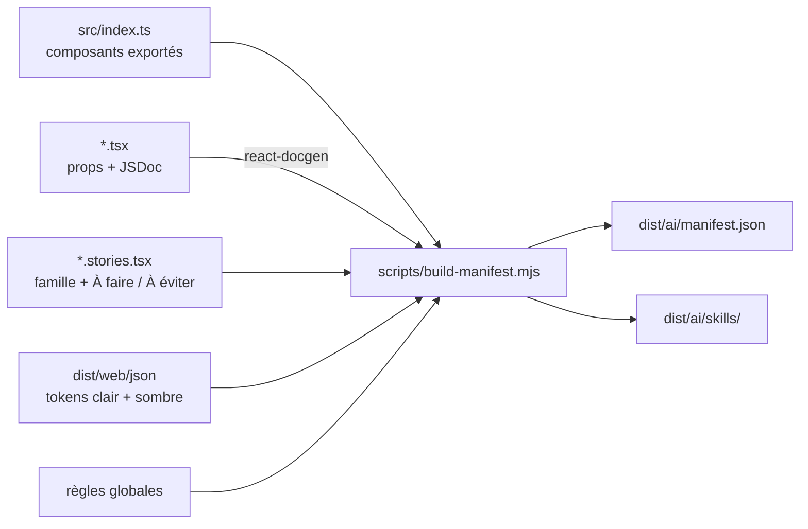
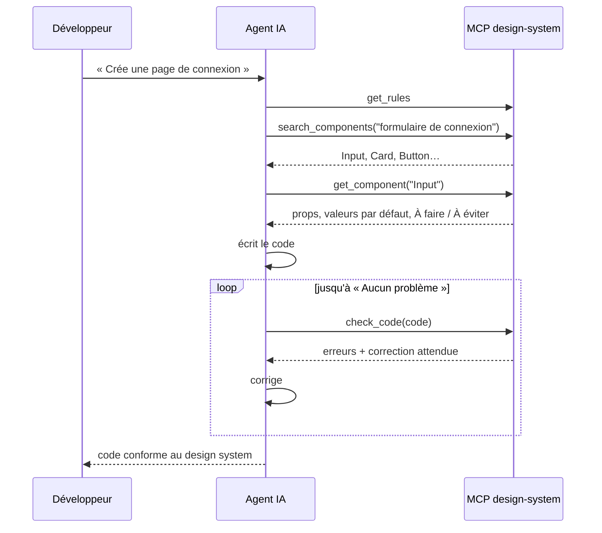

# IA et MCP

Une IA qui ne connaît pas le design system invente : un bouton « tertiary », une couleur `#333`, un composant `Accordion`. Le design system lui fournit trois briques, toutes **générées depuis le code**, donc jamais en retard sur lui.

| Brique | Fichier | Rôle |
|---|---|---|
| **Manifeste** | `dist/ai/manifest.json` | Description complète : règles, exports, composants (props, types, valeurs par défaut, JSDoc, « À faire / À éviter »), tokens avec leurs valeurs claires et sombres |
| **Skill** | `ai/skills/design-system/SKILL.md` | Méthode de travail de l'agent et liste de vérification |
| **Serveur MCP** | `mcp/server.mjs` | Outils pour interroger le manifeste et **vérifier** le code produit |
| Guide du dépôt | `AGENTS.md` (+ `CLAUDE.md`) | Conventions pour un agent qui travaille **sur** ce dépôt |

## Génération du manifeste



## Le serveur MCP

| Outil | Rôle |
|---|---|
| `get_rules` | Règles à respecter et instructions d'installation (à lire en premier) |
| `list_components` | Composants par famille |
| `get_component` | Fiche complète d'un composant |
| `search_components` | Composants adaptés à un besoin décrit en français |
| `search_tokens` | Tokens sémantiques (et primitifs sur demande) avec leurs valeurs claires et sombres |
| `check_code` | Vérifie du code TSX/JSX ou CSS contre le design system |

Ressource : `design-system://manifest` (le manifeste complet).

### La boucle de travail d'un agent



### Ce que `check_code` détecte

| Problème | Gravité | Exemple de message |
|---|---|---|
| Composant ou export inventé | erreur | « Accordion » n'est pas exporté par design-system-starter |
| Valeur de prop inexistante | erreur | Button : variant="tertiary" n'existe pas. Valeurs possibles : primary, secondary, ghost, danger |
| Prop obligatoire absente | erreur | Input : la prop obligatoire « label » est absente |
| Token inventé | erreur | Le token --color-nope n'existe pas |
| Couleur en dur, emoji, image sans `alt` | erreur | Couleur en dur #333 : utiliser un token sémantique |
| Valeur brute en CSS | erreur | règles Stylelint du design system |
| Token primitif utilisé dans une app | avertissement | --color-gray-500 est un token PRIMITIF |
| Taille brute en style en ligne | avertissement | Valeur brute « padding: 12 » |
| Élément HTML natif remplaçable | avertissement | `<button>` natif : utiliser le composant Button |
| Plusieurs boutons `primary` | avertissement | un seul par écran |

Les vérifications sont des fonctions pures (`mcp/checks.mjs`), couvertes par des tests (`mcp/checks.test.mjs`) qui vérifient aussi qu'un code correct ne déclenche **aucune** alerte.

> `check_code` analyse le code avec des expressions régulières, pas avec un compilateur : il couvre les erreurs courantes mais peut rater un cas inhabituel. Dans une application, TypeScript reste le filet principal.

## Installation

**Dans ce dépôt** : Claude Code détecte `.mcp.json` (serveur lancé via Docker) et propose de l'activer au démarrage ; il lit `AGENTS.md` via `CLAUDE.md`.

**Dans une application** qui a installé le paquet :

```bash
claude mcp add design-system -- npx design-system-mcp
mkdir -p .claude/skills && cp -r node_modules/design-system-starter/dist/ai/skills/design-system .claude/skills/
```

Les mêmes règles CSS que le design system, dans l'application (`.stylelintrc.json`) :

```json
{ "extends": ["design-system-starter/stylelint-config"] }
```
