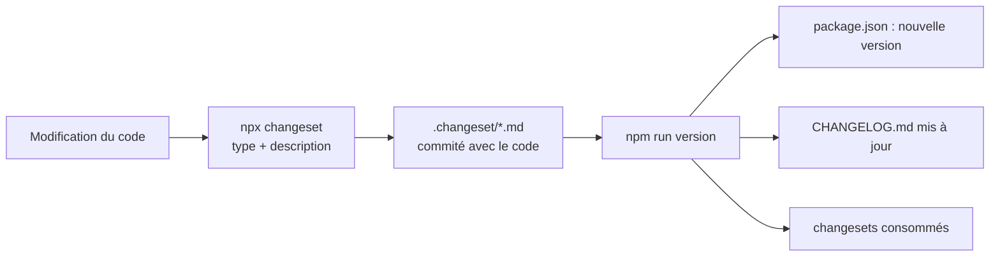

# Versions et publication

## Versionnage sémantique

Le numéro de version `MAJEUR.MINEUR.CORRECTIF` dit à une application si elle peut mettre à jour sans risque.

| Type | Quand | Exemple dans un design system |
|---|---|---|
| `patch` | correction, rien ne casse | le survol d'un bouton avait la mauvaise couleur |
| `minor` | nouveauté, rien ne casse | nouveau composant, nouveau token, nouvelle prop |
| `major` | changement **cassant** | renommer une prop, supprimer un token déprécié |

Question à se poser : *« si une application met à jour sans changer son code, est-ce qu'elle casse ? »* Si oui, c'est `major`. Une version qui commence par `0.` signale une API encore en construction.

## Changesets

Chaque modification qui change le paquet s'accompagne d'un **changeset** : un petit fichier dans `.changeset/` qui indique son type et la décrit en une phrase.



```bash
docker compose run --rm node npx changeset      # décrire la modification
docker compose run --rm node npm run version    # nouvelle version + CHANGELOG.md
```

Plusieurs changesets s'additionnent : le type le plus fort l'emporte (un `minor` et deux `patch` donnent une version mineure).

## Le paquet

`npm run build` produit tout ce que le paquet contient. Seuls `dist/`, `mcp/` et `config/` sont publiés (`files` dans `package.json`).

| Import | Fichier |
|---|---|
| `design-system-starter` | `dist/lib/index.js` + types `dist/lib/types/` |
| `design-system-starter/styles.css` | `dist/lib/styles.css` : tokens + composants + styles de base |
| `design-system-starter/tokens/css/light.css`, `…/tokens/js/light.js`… | `dist/web/` |
| `design-system-starter/ai/manifest.json` | `dist/ai/` |
| `design-system-starter/stylelint-config` | `config/stylelint.json` |
| commande `design-system-mcp` | `mcp/server.mjs` |

`react`, `react-dom` (19+) et `lucide-react` sont des **peerDependencies** : l'application les installe, pour qu'il n'existe qu'un seul React.

## Installer dans une application

```bash
# Dans le design system
docker compose run --rm node npm pack      # produit design-system-starter-<version>.tgz

# Dans l'application
npm install ../chemin/design-system-starter-<version>.tgz lucide-react
```

Pour plusieurs projets, publier sur un registre privé (GitLab Package Registry, GitHub Packages) : le paquet est marqué `private` pour éviter une publication accidentelle sur le registre public npm ; retirer ce champ et configurer `publishConfig` le moment venu.

```tsx
// Une seule fois, à la racine de l'application
import 'design-system-starter/styles.css';

import { Button, Input, ToastProvider } from 'design-system-starter';
import { Search } from 'lucide-react';
```

- Thème sombre : `data-theme="dark"` sur `<html>` (voir [Thèmes](04-themes.md)).
- Polices : chargées par l'application (le design system ne fournit que leurs noms).
