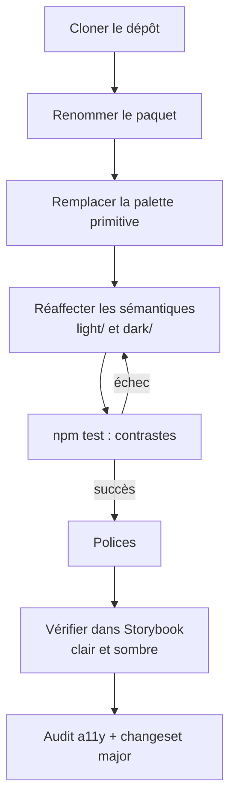

# Adapter le starter à un nouveau projet

Le dépôt est un **point de départ** : la palette jaune et noire, les polices Orbitron et Inter et les textes des stories sont des **exemples** à remplacer.



## 1. Renommer

| Où | Quoi |
|---|---|
| `package.json` | `name`, `description`, `version` (repartir de `0.1.0`), `bin` si besoin |
| `build-tokens.mjs` | `PREFIX` (types générés : `DSTokens`…) et `ANDROID_PACKAGE` |
| `.storybook/theme.ts` | `brandTitle` |
| `ai/skills/design-system/SKILL.md`, `.storybook/preview-head.html` | nom du paquet dans les exemples, polices chargées |
| `CHANGELOG.md` | repartir d'un fichier vide |

## 2. Remplacer la palette

Dans `tokens/primitive/color.json`, remplacer la couleur de marque (`yellow`) par celle du projet, **avec plusieurs nuances** (`300`, `500`, `600`, `700`) : les états de survol et les fonds clairs en ont besoin.

## 3. Réaffecter les sémantiques

Dans `tokens/semantic/light/color.json` et `dark/color.json`, pointer les rôles (`action.primary`, `text.on-brand`, `border.focus`…) vers les nouvelles nuances. `npm test` indique chaque paire dont le contraste est insuffisant.

> Exemple vécu : un jaune de marque ne supporte pas de texte blanc (contraste 2,2) ; il impose `text.on-brand` noir, et un anneau de focus noir en thème clair.

## 4. Polices

- `tokens/primitive/font.json` : familles `display` (titres) et `body` (texte courant). Une police d'affichage très stylisée ne convient pas au texte courant.
- `.storybook/preview-head.html` : chargement des polices pour Storybook.

## 5. Vérifier

```bash
docker compose run --rm node npm run check
docker compose up storybook          # parcourir les composants en clair et en sombre
docker compose run --rm a11y         # audit complet
```
